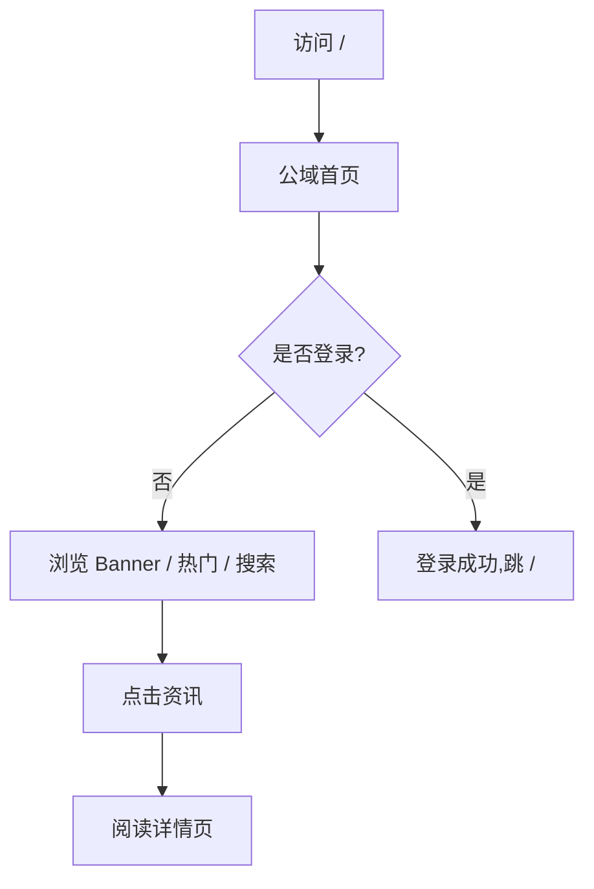

# fastInfo · Web 平台 PRD

> 版本:1.0 · 日期:2026-07-02 · 状态:待审阅
> 关联工程:`d:\WORK\trae\fast_info` (后端 + 数据已具备,新增前端 + 文档站)
> 关联文档:`docs/day1-deliverable.md` / `docs/day2-deliverable.md` / `AGENTS.md`

---

## 1. 产品概述

fastInfo 是一个**个人化 AI 情报中枢**,后端已具备 RSS 抓取 + LLM 摘要 + 用户订阅全链路(Day 1+2 已完工)。本次交付一个 Web 可视化平台,提供**管理员视角**(看爬取任务、看所有数据、看汇总和明细)+ **用户视角**(注册登录、订阅、按类目看今日最热、按订阅看个人推送)+ **文档入口**(全 API 使用说明)。

- **核心问题**:目前所有能力只能通过 CLI 命令行或 HTTP 调试使用,门槛高,无 UI
- **目标用户**:
  - 平台管理员(看采集效果、排查抓取问题、配置 Banner 类目)
  - 普通注册用户(订阅感兴趣的主题、浏览公开热门、查个人推送)
- **市场/战略价值**:把 fastInfo 从"开发者工具"升级到"个人化情报终端",从"能跑"升级到"可使用"

---

## 2. 核心功能

### 2.1 用户角色

| 角色 | 注册方式 | 核心权限 |
|------|----------|----------|
| **游客** | 无需注册 | 浏览公域(Banner / 今日热门 / 全局搜索 / 阅读文档) |
| **普通用户** | 用户名+密码注册 | 游客全部 + 创建/管理个人订阅 + 查看个人推送 + 触发手动抓取(自己的订阅) |
| **管理员** | 数据库预置(role=admin) | 普通用户全部 + 看爬取任务时间线 + 看所有用户/订阅/抓取记录 + 配置 Banner 类目 + 触发全局 ingest |

### 2.2 功能模块

1. **公域首页** `/` —— Banner 轮播(按类目分组)/ 今日热门 / 全局搜索入口 / 最新 30 条资讯瀑布流
2. **登录/注册** `/login` `/register` —— 用户名密码,JWT 持久化到 localStorage
3. **今日最热(按类目)** `/hot` —— 类目 tab,每个 tab 下显示该类目今日高相关度内容
4. **全局搜索结果** `/search?q=` —— 标题/摘要/关键词命中,带分页
5. **资讯详情** `/items/:id` —— 完整摘要 + 关键点 + 原文链接 + 所属分类热度
6. **个人中心** `/me` —— 我的资料 / 我的订阅列表(分页) / 个人推送 inbox(按热度/时间/类目/订阅名排序筛选)
7. **创建订阅** `/subs/new` —— 自然语言输入,后端 NL→cron,可预览定时
8. **爬取任务监控(管理员)** `/admin/tasks` —— 7 个 RSS 源运行状态 / 摘要模型调用情况 / 失败重试 / 时间线
9. **爬取任务明细(管理员)** `/admin/tasks/:runId` —— 一次抓取跑了哪些源、抓了几条、生成摘要用了哪个模型、耗时
10. **汇总统计(管理员)** `/admin/stats` —— 总数据量 / 7 源分布 / 类目分布 / LLM 调用分布(模型组 × 当日调用次数 + 平均耗时)
11. **Banner 配置(管理员)** `/admin/banner` —— 选择哪些类目出现在公域 Banner / 顺序 / 上限条数
12. **API 文档** `/docs` —— VitePress 文档站,内嵌 FastAPI Swagger UI iframe(自动同步),左侧中文教程

### 2.3 页面细节

| 页面 | 模块 | 功能描述 |
|------|------|----------|
| 公域首页 `/` | Banner 区 | 横向滚动/淡入切换,按类目分块,管理员可配置显示哪些类目,每块展示该类目今日热度 Top 3 |
| 公域首页 `/` | 今日热门 Top 10 | 横向卡片,展示标题/摘要/类目/relevance/发布时间/来源 |
| 公域首页 `/` | 全局搜索框 | 顶部固定,输入后跳转 `/search?q=`,回车即搜 |
| 公域首页 `/` | 最新 30 条瀑布流 | 按发布时间倒序,卡片展示 |
| 登录 `/login` | 表单 | 用户名 + 密码,登录成功后跳 `/`,JWT 存 localStorage |
| 注册 `/register` | 表单 | 用户名 + 密码 + 邮箱(可选),提交后自动登录 |
| 今日最热(按类目) `/hot` | 类目 tab | 类目来自 `items.category` 的 distinct,默认 5-7 个 tab(AI / 科技 / 财经 / 汽车 / 娱乐 / 体育 / 其他) |
| 今日最热(按类目) `/hot` | 内容列表 | 每条卡片:标题 + 摘要 + 关键点 + relevance + 发布时间 |
| 全局搜索 `/search?q=` | 搜索结果 | 命中高亮,带分页(20 条/页) |
| 资讯详情 `/items/:id` | 头部 | 标题 + 来源 + 发布时间 + 摘要模型 + 原文链接 |
| 资讯详情 `/items/:id` | 正文 | LLM 生成 summary + 3-5 个 key_points + category + tags |
| 资讯详情 `/items/:id` | 同类目 | 右栏:该类目今日相关 Top 5 |
| 个人中心 `/me` | 资料卡 | 用户名 / 注册时间 / plan / last_login |
| 个人中心 `/me` | 我的订阅 | 列表(标题/NL原文/cron/上次跑/启停状态),支持立即跑 / 暂停 / 启用 / 删除 |
| 个人中心 `/me` | 我的推送 inbox | 表格:订阅名/标题/类目/relevance/时间/已读,排序:热度/时间,筛选:按订阅名/类目 |
| 创建订阅 `/subs/new` | NL 输入框 | 占位符示例:"每天 9 点看 AI 资讯",提交后展示解析结果(标题/keywords/cron)可调整后保存 |
| 爬取任务监控 `/admin/tasks` | RSS 源状态卡 | 7 张卡:36kr / huxiu / ifanr / qbitai / infoq / sspai / ithome,显示"上次成功时间 / 上次耗时 / 24h 抓取数 / 失败次数" |
| 爬取任务监控 `/admin/tasks` | LLM 模型健康 | 当前模型组 × provider 状态,熔断是否开启 |
| 爬取任务监控 `/admin/tasks` | 时间线 | 最近 24h 抓取事件列表 |
| 爬取任务明细 `/admin/tasks/:runId` | 抓取明细 | 这次跑了哪些源、抓了几条、成功/失败列表 |
| 爬取任务明细 `/admin/tasks/:runId` | 摘要明细 | 每条 item 用哪个模型、耗时、tokens、quality 评估(预留位) |
| 汇总统计 `/admin/stats` | 总览 | 总 items / 总用户 / 总订阅 / 总推送 |
| 汇总统计 `/admin/stats` | 源分布 | 柱状图:每个源占比 |
| 汇总统计 `/admin/stats` | 类目分布 | 饼图:类目占比 |
| 汇总统计 `/admin/stats` | LLM 调用分布 | 堆叠柱:4 个模型组 × 当日调用次数 + 平均延迟 |
| Banner 配置 `/admin/banner` | 类目多选 + 排序 | 拖拽排序,上限 5 个,保存后公域首页 Banner 即时生效 |
| API 文档 `/docs` | 侧边导航 | 快速开始 / 概念 / 鉴权 / 全部 15 个 endpoint 说明 + cURL 示例 |
| API 文档 `/docs` | 在线测试 | iframe 嵌入 `/api/docs` Swagger UI,可在线试 |

---

## 3. 核心流程

### 3.1 游客浏览流程



### 3.2 用户订阅流程

```mermaid
flowchart TD
    A[已登录用户] --> B[/subs/new]
    B --> C[输入 NL: 每天 9 点看 AI 资讯]
    C --> D[POST /api/subs NL 解析]
    D --> E{解析成功?}
    E -- 是 --> F[展示 cron + keywords + title,用户可调整]
    E -- 否 --> G[展示兜底结果 + 重试按钮]
    F --> H[确认 → 写 MongoDB.subscriptions]
    H --> I[跳 /me 看到订阅列表]
    I --> J[点击立即跑] --> K[POST /api/subs/:id/run]
    K --> L[匹配 items,写入 subscriptions_delivered]
    L --> M[/me inbox 显示]
```

### 3.3 管理员查爬取任务

```mermaid
flowchart TD
    A[管理员访问 /admin/tasks] --> B[拉取 7 个 RSS 源状态]
    A --> C[拉取 LLM 模型健康]
    A --> D[拉取 24h 抓取事件]
    B --> E[点击某源卡片] --> F[/admin/tasks/:runId 详情]
    F --> G[查看本次跑了几条/用哪个模型/失败原因]
```

---

## 4. 用户界面设计

### 4.1 设计风格

- **主色调**:深空蓝(#0F172A 主)+ 翠绿(#10B981 强调)+ 琥珀(#F59E0B 提示)
- **辅助色**:暗灰底(#1E293B 卡片)+ 雾灰(#64748B 文字)+ 米白(#F8FAFC 高亮文字)
- **按钮风格**:圆角 8px,主按钮实心绿,次按钮描边,危险按钮红色
- **字体**:
  - 标题:`Source Han Sans SC`(思源黑体,免费,中文显示佳)
  - 正文:`PingFang SC` (Mac) / `Microsoft YaHei` (Win) / `Noto Sans CJK SC` (Linux) 字体栈
  - 代码 / 数字:`JetBrains Mono` (免费,等宽)
- **布局**:顶部固定 nav + 内容区(最大宽度 1200px,居中) + 右侧抽屉(管理员/详情),卡片化 + 阴影柔和
- **图标**:Phosphor Icons(开源,1.5px 线性风格,跟科技感契合)
- **情感基调**:理性、专业、信息密度适中,留白充足,色彩克制

### 4.2 页面设计概览

| 页面 | 模块 | UI 元素 |
|------|------|---------|
| 公域首页 | Banner | 横向卡片,每类目一卡(高度 200px,深色背景 + 浅色文字),淡入切换 5s,鼠标悬停暂停 |
| 公域首页 | 热门卡片 | 标题(18px 粗体)+ 摘要(14px 灰,2 行截断)+ 底部行(类目标签 + relevance + 时间 + 来源) |
| 资讯详情 | 关键点 | 圆点列表,缩进 16px,字号 15px |
| 个人中心 | 订阅列表 | 表格(标题/NL/cron/状态/操作),行 hover 高亮 |
| 个人中心 | inbox | 表格(订阅/标题/类目/rel/时间/操作),顶部筛选条(订阅名 input + 类目 select + 排序 select) |
| 管理员任务 | 源状态卡 | 7 张并排卡(1120 / 7 ≈ 150px 宽),卡内 4 行:源名/上次成功/上次耗时/失败数,异常时左下角红点 |
| 管理员汇总 | 图表 | ECharts 5(免费,主题:dark),柱/饼/堆叠柱 |
| API 文档 | 侧边栏 | VitePress 默认 + 自定义右侧"在线测试"按钮打开 iframe |

### 4.3 响应式

- **桌面优先**(1280px+):三栏(主内容 800 + 右栏 360)
- **平板**(768-1280px):两栏(主 + 右折叠为抽屉)
- **手机**(<768px):单栏,顶部 nav 折叠为汉堡按钮,管理员页面 mobile 不开放(只 desktop 体验)

### 4.4 不使用 3D

本项目为信息密集型后台,不做 3D 场景,避免无谓视觉噪声。

---

## 5. 数据模型(增量,不动现有 4 集合)

### 5.1 banner_config(新增)

```json
{
  "_id": "ObjectId",
  "categories": ["AI", "科技", "财经"],
  "max_per_category": 3,
  "updated_at": "ISODate",
  "updated_by": "admin_user_id"
}
```

### 5.2 task_runs(新增,管理员页面用)

```json
{
  "_id": "ObjectId",
  "run_id": "uuid",
  "started_at": "ISODate",
  "finished_at": "ISODate",
  "trigger": "scheduled | manual_api | manual_admin | subs_run",
  "operator": "user_id | null",
  "items_fetched": 12,
  "items_summarized": 12,
  "items_failed": 0,
  "per_source": {
    "ithome": {"fetched": 5, "summarized": 5, "errors": 0, "latency_ms": 1200},
    "36kr":  {"fetched": 3, "summarized": 3, "errors": 0, "latency_ms": 900}
  },
  "llm_breakdown": {
    "short_summary": {"M2.7-highspeed": {"calls": 10, "avg_ms": 850}},
    "nl_parse":      {"M2.7-highspeed": {"calls": 0,  "avg_ms": 0}}
  }
}
```

### 5.3 inbox 视图(前端读库,无需新表)

```
GET /api/inbox?user_id=&sort=relevance|time&subscription=&category=&page=
```
后端简单聚合:`subscriptions_delivered` join `items`,返回带订阅名/类目的列表。

---

## 6. 新增 / 修改的 API 列表

| Method | Path | 鉴权 | 说明 | 优先级 |
|---|---|---|---|---|
| GET  | `/api/tasks/runs?limit=20` | admin | 爬取任务时间线 | P0 |
| GET  | `/api/tasks/runs/:run_id` | admin | 单次抓取明细 | P0 |
| GET  | `/api/tasks/source-status` | admin | 7 个源最新状态 | P0 |
| GET  | `/api/llm/health` | admin | 模型组 × provider 状态 | P0 |
| GET  | `/api/banner` | 公开 | 当前生效的 banner 类目配置 | P0 |
| PUT  | `/api/banner` | admin | 更新 banner 配置 | P1 |
| GET  | `/api/inbox?sort=&subscription=&category=&page=` | Bearer | 用户 inbox | P0 |
| GET  | `/api/categories` | 公开 | 当前所有类目 distinct | P0 |

`/api/docs`(FastAPI Swagger)继续保留,VitePress 文档站 iframe 引用它。

---

## 7. 验收标准

### 7.1 功能

- 游客能完成:看 Banner / 看热门 / 搜索 / 看详情 / 打开文档
- 用户能完成:注册/登录 → 创建 NL 订阅 → 立即跑 → inbox 看到 → 删除订阅
- 管理员能完成:看 7 源状态 / 看 24h 时间线 / 看明细 / 看 LLM 健康 / 配置 Banner / 触发全局 ingest

### 7.2 性能

- 首屏 Lighthouse Performance ≥ 85
- 列表页 LCP < 2.0s
- 后端响应 P95 < 300ms(LLM 不算)

### 7.3 可用性

- 桌面 + 平板能用
- 关键路径(注册/登录/订阅/inbox/详情)无障碍可达(tab 键 / aria-label)

### 7.4 兼容性

- Chrome 110+ / Edge 110+ / Firefox 110+
- 不支持 IE

---

## 8. 范围外(明确不做)

- 用户间社交(关注/点赞/评论)
- 内容质量评分(只是预留字段)
- 推送通道(邮件/Webhook)—— Day 5+ 任务
- 移动端 App / 小程序
- 国际化(只中文,文档站预留 i18n 目录结构但只填 zh-CN)
- 单点登录 / 第三方登录

---

## 9. 交付物

- 前端:`frontend/`(Vue3 + Vite + Naive UI)
- 文档站:`docs-site/`(VitePress)
- 后端增量:`src/api/routes/admin.py` / `src/api/routes/banner.py` / `src/api/routes/inbox.py` / `src/api/routes/categories.py`
- 后端 schema 增量:`src/api/schemas.py` 加 banner / inbox / task 相关
- 数据库增量:`scripts/init_admin_collections.py`(banner_config / task_runs 集合 + 索引)
- 部署文档:`docs/day3-deliverable.md` + `AGENTS.md §6.7 Web 平台`

---

## 10. 上线里程碑

| 阶段 | 内容 | 估计 |
|------|------|------|
| **Day 3.0** | 后端增量 API + 数据初始化 | 1 天 |
| **Day 3.1** | 前端骨架 + 登录/注册 + 公域首页 + 详情页 | 2 天 |
| **Day 3.2** | 用户中心 + 创建订阅 + inbox | 1 天 |
| **Day 3.3** | 管理员页面(任务/汇总/Banner 配置) | 1.5 天 |
| **Day 3.4** | VitePress 文档站 + 上线 | 1 天 |
| **合计** |  | **6.5 天** |

---

**审阅完成请告知 → 我会进入开发阶段,按上述模块顺序实现。**