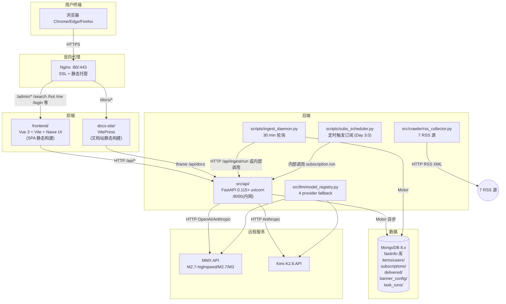
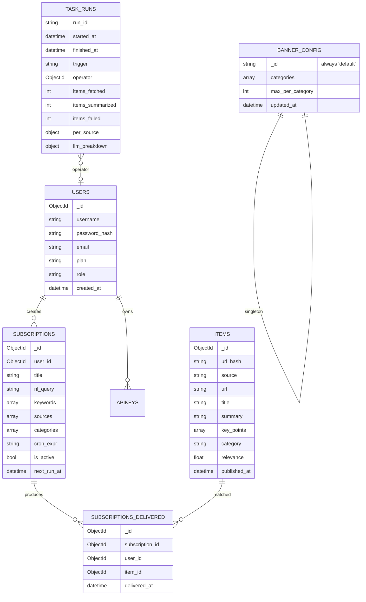

# fastInfo · Web 平台技术架构

> 版本:1.0 · 日期:2026-07-02 · 状态:待审阅
> 配套 PRD:`.trae/documents/prd.md`

---

## 1. 架构设计



---

## 2. 技术选型

### 2.1 前端

| 模块 | 选型 | 版本 | 选择理由 |
|------|------|------|----------|
| 框架 | Vue | 3.5+ | 官方文档 / 生态对中文最友好 |
| 构建 | Vite | 5.x | 启动 <1s,HMR 流畅 |
| 组件库 | Naive UI | 2.40+ | 主题系统强,中文文档,组件全(表格/表单/抽屉/Tree/分页),无任何依赖 |
| 路由 | Vue Router | 4 | 官方标配 |
| 状态 | Pinia | 2 | 官方推荐,替代 Vuex |
| HTTP | ofetch | 1 | nuxt 团队出品,自动解析 JSON,自带拦截器 |
| 图标 | @phosphor-icons/vue | 2 | 开源,线性风格,中文适配佳 |
| 图表 | ECharts | 5.5 | 中文文档全,主题丰富,体积可控(tree-shake) |
| 工具 | dayjs / @vueuse/core | 7.x | 时间处理 / 组合式工具 |
| 类型 | TypeScript | 5.4 | 类型安全,IDE 友好 |
| 代码规范 | eslint + prettier | 8 / 3 | 默认配置,无争议 |

### 2.2 文档站

| 模块 | 选型 | 版本 | 选择理由 |
|------|------|------|----------|
| 框架 | VitePress | 1.5 | Vue 官方文档站,Markdown 原生 |
| 主题 | 默认 + 自定义色板 | - | 与主站视觉一致 |
| Swagger 嵌入 | 原生 iframe | - | 零成本,自动跟 OpenAPI 同步 |

### 2.3 后端(增量,不破坏现有)

| 模块 | 选型 | 版本 | 说明 |
|------|------|------|------|
| Web | FastAPI | 0.115+ | 已有 |
| ASGI | uvicorn | 0.32+ | 已有 |
| ORM/驱动 | Motor (async) | 3.6+ | 已有,继续用 |
| 鉴权 | python-jose + passlib | 已有 | 不动 |
| 校验 | Pydantic | 2.x | 已有 |
| 日志 | loguru / 内置 logging | - | 已有 |
| 跨域 | fastapi.middleware.cors | - | 已配,前端域名加白名单 |

### 2.4 反向代理与部署

| 模块 | 选型 | 说明 |
|------|------|------|
| Web Server | Nginx | 反向代理 + 静态托管 + SSL |
| 进程管理 | systemd | `fastinfo-api.service` / `fastinfo-ingest.service` / `fastinfo-subs.service` / `fastinfo-web-deploy.service` |
| 部署方式 | 手动 scp + nginx reload | 个人项目,避免 CI/CD 复杂度 |

### 2.5 数据(增量)

| 集合 | 说明 |
|------|------|
| `banner_config` | 单例集合(只有 1 条),存当前生效的 banner 类目配置 |
| `task_runs` | 每次抓取事件留痕,供管理员页面读时间线 / 明细 |

---

## 3. 路由定义

### 3.1 前端路由

| Route | 页面 | 鉴权 | 说明 |
|-------|------|------|------|
| `/` | 公域首页 | 公开 | Banner + 热门 + 最新 |
| `/login` | 登录 | 公开 | 已有 token 自动跳 `/` |
| `/register` | 注册 | 公开 | 注册后自动登录 |
| `/hot` | 今日最热(按类目) | 公开 | 类目 tab + 列表 |
| `/search?q=&page=` | 全局搜索 | 公开 | 命中列表 |
| `/items/:id` | 资讯详情 | 公开 | 完整内容 + 同类目推荐 |
| `/me` | 个人中心 | Bearer | 资料 + 订阅 + inbox |
| `/me/inbox` | inbox(可筛选) | Bearer | `/me` 拆 tab |
| `/subs/new` | 创建订阅 | Bearer | NL 输入 + 预览 |
| `/admin` | 管理员首页(统计) | admin | 汇总仪表盘 |
| `/admin/tasks` | 爬取任务监控 | admin | 7 源状态 + 时间线 |
| `/admin/tasks/:runId` | 爬取任务明细 | admin | 本次抓取明细 |
| `/admin/banner` | Banner 配置 | admin | 类目拖拽排序 |
| `/docs/*` | 文档站 | 公开 | iframe Swagger UI + Markdown |
| `*` | 404 | - | 友好兜底 |

### 3.2 后端新增 API

| Method | Path | 鉴权 | 入参 | 返回 |
|--------|------|------|------|------|
| GET | `/api/tasks/runs?limit=20` | admin | `limit: int=20` | `[TaskRun, ...]` |
| GET | `/api/tasks/runs/:run_id` | admin | - | `TaskRun` |
| GET | `/api/tasks/source-status` | admin | - | `{source: {last_ok, last_run, fetched_24h, failed_24h}}` |
| GET | `/api/llm/health` | admin | - | `{group: {provider: {state, total, errors, opened_at}}}` |
| GET | `/api/banner` | 公开 | - | `{categories: [...], max_per_category: 3}` |
| PUT | `/api/banner` | admin | `{categories, max_per_category}` | `{ok: true}` |
| GET | `/api/inbox?sort=relevance\|time&subscription=&category=&page=` | Bearer | - | `{items, total, page}` |
| GET | `/api/categories` | 公开 | - | `["AI", "科技", ...]` |

### 3.3 TypeScript 类型(前端共享)

```ts
// frontend/src/types/api.ts
export interface Item {
  id: string;
  source: string;
  url: string;
  title: string;
  summary: string;
  key_points: string[];
  category: string;
  relevance: number;
  published_at: string;
  fetched_at: string;
  author?: string;
  tags?: string[];
  summary_model?: string;
}

export interface Subscription {
  id: string;
  title: string;
  nl_query: string;
  keywords: string[];
  sources: string[];
  categories: string[];
  cron_expr: string;
  next_run_at?: string;
  is_active: boolean;
  max_items: number;
}

export interface InboxItem extends Item {
  subscription_id: string;
  subscription_title: string;
  delivered_at: string;
}

export interface TaskRun {
  run_id: string;
  started_at: string;
  finished_at?: string;
  trigger: 'scheduled' | 'manual_api' | 'manual_admin' | 'subs_run';
  operator?: string;
  items_fetched: number;
  items_summarized: number;
  items_failed: number;
  per_source: Record<string, {fetched: number; summarized: number; errors: number; latency_ms: number}>;
  llm_breakdown: Record<string, Record<string, {calls: number; avg_ms: number}>>;
}

export interface SourceStatus {
  source: string;
  last_ok_at?: string;
  last_run_at?: string;
  fetched_24h: number;
  failed_24h: number;
  healthy: boolean;
}

export interface LLMHealth {
  groups: Record<string, Record<string, {
    state: 'CLOSED' | 'OPEN' | 'HALF_OPEN';
    total: number;
    errors: number;
    opened_at?: string;
  }>>;
}

export interface BannerConfig {
  categories: string[];
  max_per_category: number;
  updated_at: string;
}

export interface User {
  id: string;
  username: string;
  role: 'user' | 'admin';
  plan: string;
  created_at: string;
}
```

---

## 4. 后端架构

### 4.1 Controller-Service-Repository 三层

```
api/routes/*.py     ← Controller(请求/响应/鉴权)
      ↓
subscription/crawler/auth/llm  ← Service(业务逻辑)
      ↓
storage/mongo_writer.py        ← Repository(数据访问)
```

### 4.2 新增文件清单

| 路径 | 作用 |
|------|------|
| `src/api/routes/admin.py` | `/api/tasks/*` `/api/llm/health` `/api/admin/*` |
| `src/api/routes/banner.py` | `/api/banner` GET/PUT |
| `src/api/routes/inbox.py` | `/api/inbox` GET |
| `src/api/routes/categories.py` | `/api/categories` GET |
| `src/api/deps_admin.py` | `require_admin` 依赖 |
| `src/storage/mongo_writer.py` | 加 `record_task_run` / `get_recent_task_runs` / `get_source_status` / `get_banner` / `set_banner` |
| `src/subscription/admin_view.py` | 管理员视角聚合(全部订阅/全部推送/全部用户) |
| `scripts/init_admin_collections.py` | 创建 `banner_config` / `task_runs` + 索引,预置 banner 默认值 |
| `scripts/ingest_daemon.py` | 改造:每次抓取起止时写 `task_runs` 一条 |
| `src/api/schemas.py` | 加 BannerConfig/TaskRun/SourceStatus/LLMHealth/InboxItem schema |

### 4.3 关键实现细节

#### 4.3.1 task_runs 自动写入

`scripts/ingest_daemon.py` 改造:每次抓取:

```python
async def run_once(operator=None, trigger="scheduled"):
    run_id = str(uuid.uuid4())
    started_at = datetime.now(UTC)
    per_source = {}
    items_fetched = items_summarized = items_failed = 0
    llm_breakdown = {}

    for source in SOURCES:
        try:
            items = await fetch_source(source)
            per_source[source] = {"fetched": len(items), "summarized": 0, "errors": 0, "latency_ms": ...}
            items_fetched += len(items)
        except Exception as e:
            per_source[source] = {"fetched": 0, "summarized": 0, "errors": 1, "latency_ms": 0}

    # 摘要阶段:记录每个 item 用哪个模型组 / provider / 耗时
    # llm_breakdown["short_summary"]["M2.7-highspeed"]["calls"] += 1
    # llm_breakdown["short_summary"]["M2.7-highspeed"]["avg_ms"] = (running_avg)

    finished_at = datetime.now(UTC)
    record_task_run({
        "run_id": run_id, "started_at": started_at, "finished_at": finished_at,
        "trigger": trigger, "operator": operator,
        "items_fetched": items_fetched, "items_summarized": items_summarized, "items_failed": items_failed,
        "per_source": per_source, "llm_breakdown": llm_breakdown,
    })
```

#### 4.3.2 LLM 链路打点

在 `src/llm/model_registry.py` 的 `_select_provider` + `_call_with_retry` 出口处,加一个可选 callback `on_call(group, provider, latency_ms, ok)`,daemon 传一个记录器进来汇总到 `llm_breakdown`。这样**不影响正常调用**,只在 daemon 跑的时候统计。

#### 4.3.3 admin 鉴权

`src/api/deps_admin.py`:

```python
from fastapi import Depends, HTTPException, status
from api.deps import require_user

async def require_admin(user: dict = Depends(require_user)) -> dict:
    if user.get("role") != "admin":
        raise HTTPException(status.HTTP_403_FORBIDDEN, "需要管理员权限")
    return user
```

预置 admin 账号:`scripts/init_admin.py`,用户名 `admin`,密码首次生成后打印,提示用户改密码。

#### 4.3.4 banner_config 单例

```python
DEFAULT_BANNER = {"categories": ["AI", "科技", "财经"], "max_per_category": 3}

def get_banner() -> dict:
    doc = db["banner_config"].find_one({"_id": "default"})
    if not doc:
        db["banner_config"].insert_one({"_id": "default", **DEFAULT_BANNER, "updated_at": datetime.now(UTC)})
        return DEFAULT_BANNER
    return doc

def set_banner(categories: list[str], max_per_category: int, by_user: str):
    db["banner_config"].update_one(
        {"_id": "default"},
        {"$set": {"categories": categories, "max_per_category": max_per_category,
                  "updated_at": datetime.now(UTC), "updated_by": by_user}}
    )
```

---

## 5. 数据模型(全量,含现状)

### 5.1 ER 图



### 5.2 DDL(脚本生成的 Mongo 集合 + 索引)

```javascript
// banner_config
db.banner_config.createIndex({_id: 1})

// task_runs
db.task_runs.createIndex({started_at: -1})
db.task_runs.createIndex({"per_source.ithome": 1}, {sparse: true})
db.task_runs.createIndex({trigger: 1, started_at: -1})
db.task_runs.createIndex({operator: 1, started_at: -1})

// inbox 视图索引(已有 subscriptions_delivered 加一个)
db.subscriptions_delivered.createIndex({user_id: 1, delivered_at: -1})
```

### 5.3 初始数据

```python
# banner_config
{
    "_id": "default",
    "categories": ["AI", "科技", "财经"],
    "max_per_category": 3,
    "updated_at": ISODate("2026-07-02T00:00:00Z"),
    "updated_by": None
}

# admin 账号
{
    "username": "admin",
    "password_hash": "<bcrypt from init_admin.py>",
    "email": "admin@local",
    "plan": "admin",
    "role": "admin",
    "created_at": ISODate("2026-07-02T00:00:00Z")
}
```

---

## 6. 部署架构

### 6.1 单机部署(阿里云 ECS 2C2G,已有)

```
/opt/fastinfo/
├── src/                     ← Python 源码(已有)
├── scripts/
├── examples/
├── docs/
├── .venv/
├── frontend/                ← 新增
│   ├── dist/                ← Vite 构建产物(被 nginx 静态托管)
│   ├── package.json
│   └── vite.config.ts
├── docs-site/               ← 新增
│   ├── .vitepress/dist/     ← 文档站构建产物
│   └── package.json
├── data/
└── .env

/etc/nginx/sites-enabled/fastinfo.conf
├── server {
│     listen 80;
│     server_name _;
│     root /opt/fastinfo/frontend/dist;
│     index index.html;
│     location /api/        { proxy_pass http://127.0.0.1:8000; }
│     location /docs/       { alias /opt/fastinfo/docs-site/.vitepress/dist/; }
│     location /            { try_files $uri $uri/ /index.html; }  # SPA fallback
│ }
```

### 6.2 systemd units(已有 + 新增)

```ini
# /etc/systemd/system/fastinfo-api.service  (已有)
[Service]
ExecStart=/opt/fastinfo/.venv/bin/python /opt/fastinfo/scripts/api_server.py --host 127.0.0.1 --port 8000
Restart=always

# /etc/systemd/system/fastinfo-ingest.service  (已有)
[Service]
ExecStart=/opt/fastinfo/.venv/bin/python /opt/fastinfo/scripts/ingest_daemon.py --interval 1800
Restart=always

# /etc/systemd/system/fastinfo-subs.service  (新增 Day 3)
[Service]
ExecStart=/opt/fastinfo/.venv/bin/python /opt/fastinfo/scripts/subs_scheduler.py
Restart=always
```

### 6.3 部署步骤(本地开发)

```powershell
# 后端
.\.venv\Scripts\Activate.ps1
python scripts/init_admin_collections.py
python scripts/api_server.py                # http://127.0.0.1:8000

# 前端
cd frontend
npm install
npm run dev                                # http://localhost:5173

# 文档站
cd docs-site
npm install
npm run dev                                # http://localhost:5174

# 前端代理: vite.config.ts
server.proxy = {
  "/api": { target: "http://127.0.0.1:8000", changeOrigin: true },
  "/docs": { target: "http://127.0.0.1:5174", changeOrigin: true }
}
```

---

## 7. 安全

- **前端**:JWT 存 localStorage,加 HttpOnly cookie 不必要(纯内网部署)
- **后端**:所有 `/api/admin/*` 必须 admin 角色;`/api/subs/*` 必须登录
- **CORS**:只允许本机前端 `localhost:5173` + 文档站 `localhost:5174`,生产域名(如 `fastinfo.example.com`)
- **密码**:PBKDF2 200k 轮(已实装);admin 首次密码初始化脚本一次性,登录后强制改
- **Mongo**:只 listen `127.0.0.1`,不开放外网
- **LLM API key**:只在 `.env`,不写到前端

---

## 8. 性能预算

| 页面 | 首屏目标 | 包大小预算 |
|------|----------|-----------|
| 公域首页 | < 2.0s LCP | main < 250KB gzip |
| 详情页 | < 1.5s | main < 200KB gzip |
| 后台表格 | < 1.5s | main < 300KB gzip |
| ECharts 图表 | < 2.5s | echarts 走 lazy import |

---

## 9. 不在范围

(同 PRD §8)

---

## 10. 风险与缓解

| 风险 | 概率 | 影响 | 缓解 |
|------|------|------|------|
| VitePress + Swagger iframe 集成偶发 CORS | 中 | 中 | 文档站和 API 同源(nginx 反代 `/docs` 时顺便代理 `/api/docs`) |
| ECharts 包大 | 高 | 低 | tree-shake,按需引入柱/饼/堆叠柱 |
| task_runs 长期累积 | 中 | 低 | 索引 + 月度清理脚本(>90 天) |
| admin 账号密码泄露 | 低 | 高 | 强制首次改密 + 定期 90 天提醒 |

---

**审阅完成请告知 → 进入开发阶段。**