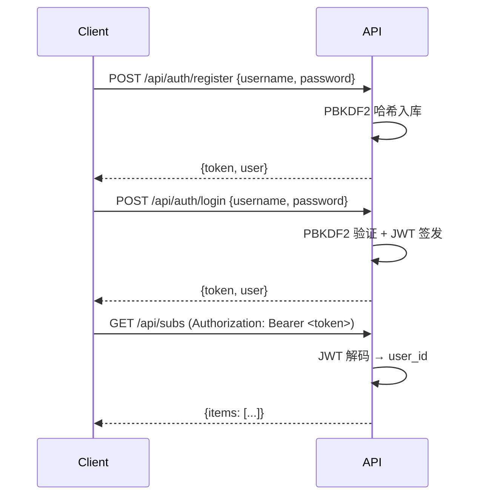

# 鉴权

## 概述

fastInfo 用 **JWT (HS256)** 做 API 鉴权。所有需要鉴权的接口都在 HTTP header 携带:

```
Authorization: Bearer <token>
```

## 流程



## 注册

```http
POST /api/auth/register
Content-Type: application/json

{
  "username": "alice",
  "password": "p@ssw0rd",   // ≥ 6 位
  "email": "alice@example.com"   // 可选
}
```

返回:

```json
{
  "token": "eyJhbGciOiJIUzI1NiIs...",
  "user": {
    "id": "u_alice",
    "username": "alice",
    "email": "alice@example.com",
    "role": "user",
    "plan": "free",
    "created_at": "2026-07-02T10:00:00Z"
  }
}
```

## 登录

```http
POST /api/auth/login
Content-Type: application/json

{
  "username": "alice",
  "password": "p@ssw0rd"
}
```

## 当前用户

```http
GET /api/auth/me
Authorization: Bearer <token>
```

## 管理员

管理员通过 `scripts/init_admin.py` 创建:

```powershell
python scripts/init_admin.py --username admin --password "admin@2026"
```

管理员额外可访问:
- `/api/admin/*` - 全部管理接口(用户 / 订阅 / 任务 / LLM 健康)
- `/api/banner` (PUT) - 更新 Banner 配置
- `/api/ingest/run` (无限制)
- `/api/admin/ingest/run` - 手动全局抓取

非管理员访问这些接口会返回 `403 Forbidden`。

## cURL 例子

```bash
# 1. 注册
TOKEN=$(curl -s -X POST http://127.0.0.1:8000/api/auth/register \
  -H "Content-Type: application/json" \
  -d '{"username":"alice","password":"p@ssw0rd"}' \
  | python -c "import sys,json;print(json.load(sys.stdin)['token'])")

# 2. 用 token 调鉴权接口
curl -X GET http://127.0.0.1:8000/api/auth/me \
  -H "Authorization: Bearer $TOKEN"

# 3. 创建订阅
curl -X POST http://127.0.0.1:8000/api/subs \
  -H "Authorization: Bearer $TOKEN" \
  -H "Content-Type: application/json" \
  -d '{
    "title": "AI 资讯日报",
    "nl_query": "每天 9 点看 AI 资讯",
    "max_items": 5
  }'
```

## 前端集成

前端把 token 存到 `localStorage`,每次请求自动带:

```typescript
import { api } from '@/lib/api'

const r = await api('/subs', { method: 'POST', body: {...} })
```

退出登录:清掉 `localStorage.token` 和 `localStorage.user`。

## 安全注意

- 生产环境请把 `JWT_SECRET` 改成强随机字符串(写在 `.env`)
- HTTPS 部署,避免 token 明文传输
- 密码用 PBKDF2-SHA256 + 200k 轮迭代(库自带)
- token 默认 7 天过期,可在 `src/auth/__init__.py` 调