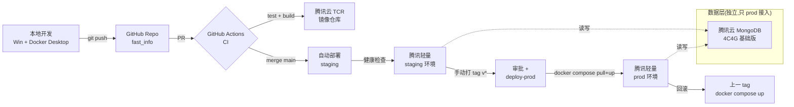
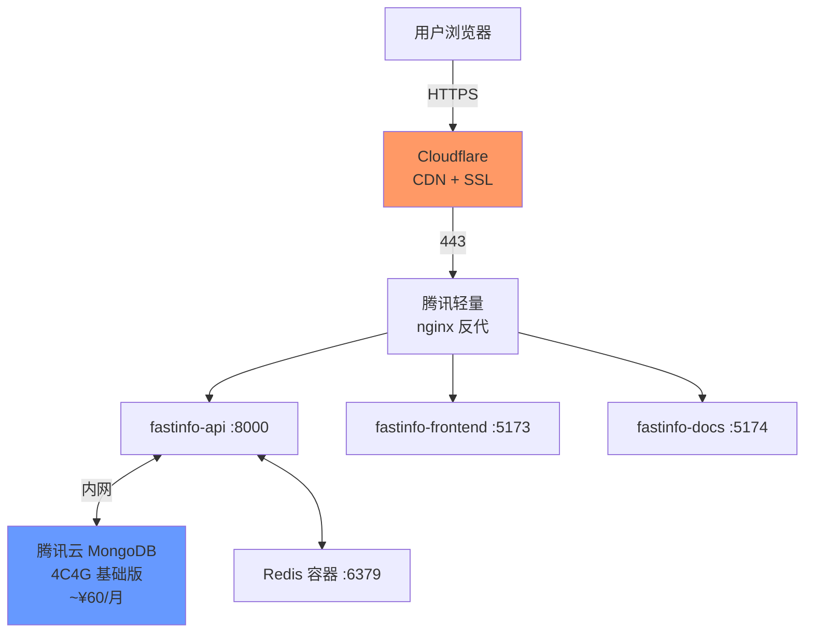
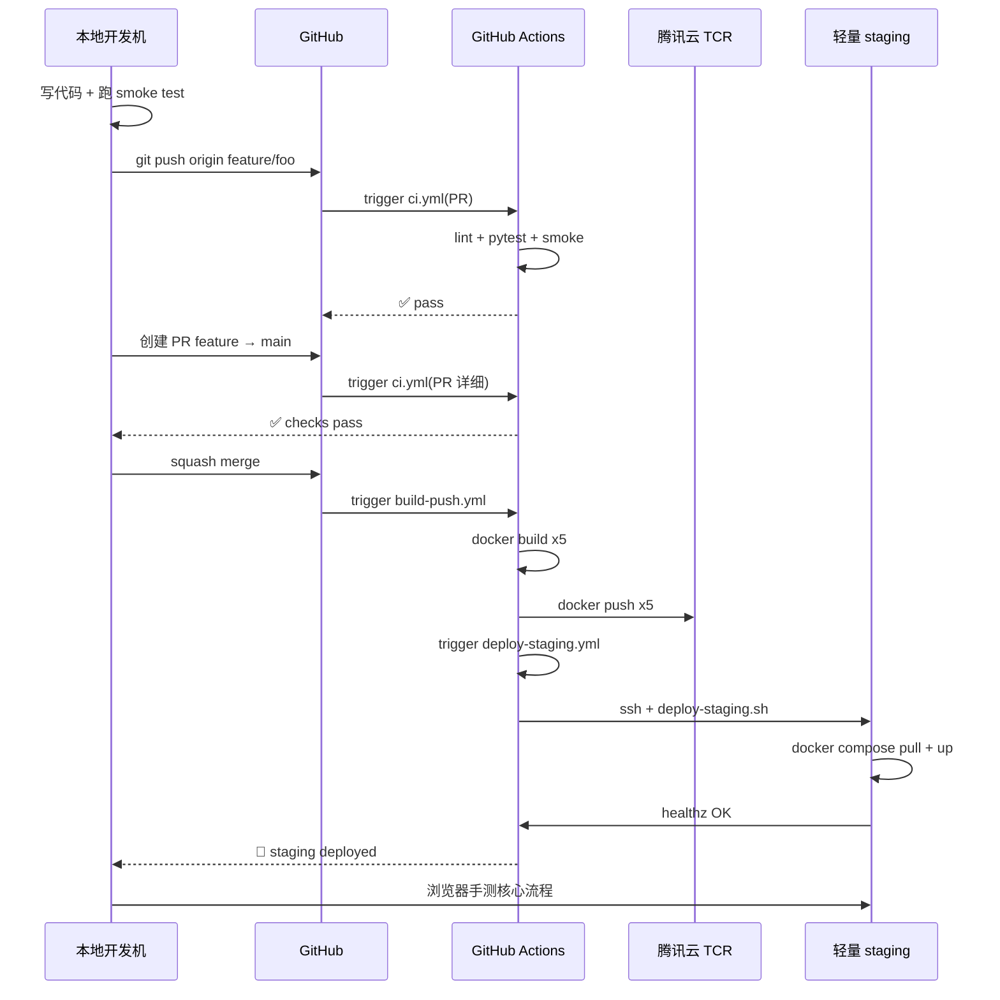
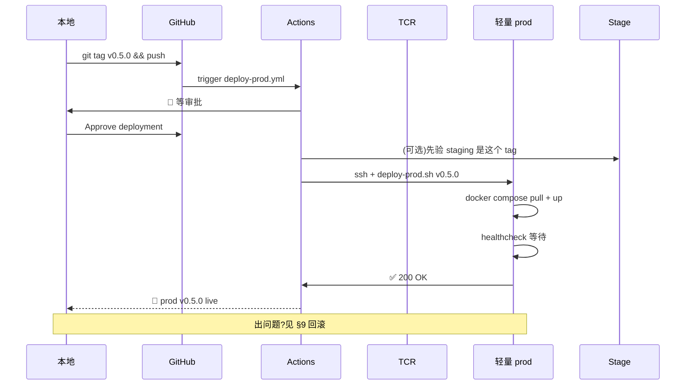

# fastInfo · 研发部署流程升级方案 v1.0

> 📌 **目标**:把"本地手搓、scp 上传、ssh 重启"升级成"push 即构建、tag 即发布、可回滚"
> 适用版本:Day 4 之后
> 作者:Mavis · 2026-07-03

---

## 0. 一句话总结

```
本地开发 → git push feature/* → PR 合并 main → GitHub Actions 自动构建镜像推 TCR
       → 自动部署 staging(预发布/Docker 验证)
       → 人工打 tag v* → 审批 → 部署生产 → 健康检查 → 完
       → 任何步骤出问题,镜像 tag 一键回滚到上一个版本
```

---

## 1. 现状与痛点(Day 4 节点)

| 维度 | 现状 | 痛点 |
|---|---|---|
| 代码 | 本地 `D:\WORK\trae\fast_info`,**未初始化 git** | 没法多机协作,没法版本回退,没法审计 |
| 分支 | 无(就一个 main 在脑子里) | 多人/多线并行直接撞车 |
| 部署 | 文档里写的"scp + ssh + systemd" | 全手动、易出错、不可回滚 |
| 容器化 | 只有 Redis 跑在 Docker 里 | API / ingest / scheduler / 前端 / 文档站都是裸跑 |
| 镜像 | 无 | 环境不一致,Win 跑得好 ECS 装不上 |
| CI/CD | 无 | 全靠人 |
| 密钥 | `.env` 本地(目前是 .env.example 公开) | 切到云上后 API key 怎么管是问题 |
| 数据 | 本机 MongoDB + 本机 Redis | 云上 Mongo 怎么搞没定 |
| 监控 | 无 | 挂了不知道 |

**结论**:现状停留在"开发机即生产机"阶段,直接上生产必出问题。升级目标是把 **开发 / 预发布 / 生产** 三套环境用 CI/CD + 镜像串起来。

---

## 2. 升级目标

| # | 目标 | 验收标准 |
|---|---|---|
| G1 | 代码进 GitHub,分支模型跑通 | `main` + `feature/*` + `tag v*`,PR 流程能合并 |
| G2 | 5 个服务全部容器化 | `docker compose up` 一次起全,5/5 健康 |
| G3 | CI 自动跑测试 + 构建镜像 | PR 触发 test,merge main 触发 build & push |
| G4 | 预发布环境自动部署 | merge main → 30 分钟内 staging 跑通 healthz |
| G5 | 生产环境一键发布 + 回滚 | tag push → 审批 → 5 分钟内 prod 跑通,出问题 1 分钟回滚 |
| G6 | 密钥/配置安全 | API key 不在仓库,只在 GitHub Secrets 和云 `.env` 里 |
| G7 | 数据持久化 | Mongo / Redis 数据在容器外卷上,容器重建不丢数据 |

---

## 3. 总体架构(端到端)



**架构要点**:
- **GitHub 仓库** = 单一真相源(本地、CI、云都从这里拉)
- **GitHub Actions** = 唯一构建者(本机只 push,不构建)
- **TCR**(腾讯云容器镜像服务)= 镜像分发中心(同地域免流量,推送快)
- **腾讯轻量** = 跑 staging + prod 两套 compose(端口错开 + 命名空间错开)
- **腾讯云 MongoDB** = 独立数据层(本机 Mongo 仍可作为 dev 数据源,staging/prod 走云 Mongo)

---

## 4. 分支策略(简化的 GitHub Flow)

> 推荐 GitHub Flow,**不上** Git Flow(后者 release/hotfix 太多,小项目扛不住)。

### 4.1 分支定义

| 分支 | 生命周期 | 谁推 | 谁合 | 说明 |
|---|---|---|---|---|
| `main` | 永久 | 任何人(只读) | **PR + 1 审批** | 唯一主干,所有发布都从这里出 |
| `feature/<name>` | 临时 | 开发者 | 开发者(自己) | 单一功能/bug,完成 → squash merge → 删 |
| `release/*` | **不用** | — | — | tag 代替,见 §4.3 |
| `hotfix/*` | **不用** | — | — | 紧急修复从 main 拉 feature,走同样流程 |

### 4.2 提交规范(Conventional Commits)

```
feat: 接入腾讯云 MongoDB
fix: ingest_daemon 偶发 hang
docs: 更新 Day 5 交付
chore: 升级 fastapi 到 0.118
refactor: 抽出 LLM 路由配置
test: 补 subs run 单元测试
```

### 4.3 Tag 规范

```bash
# 生产发布 tag,语义化版本
git tag -a v0.5.0 -m "Day 5 release"
git push origin v0.5.0

# 格式:vMAJOR.MINOR.PATCH
#   MAJOR: 破坏性变更 / 重大架构调整
#   MINOR: 新功能(每个 day 完成 = 一次 MINOR)
#   PATCH: bugfix / 文档 / 性能
```

**tag 触发生产部署**(见 §5.3)。一个 MINOR 对应一个 day 完工点,符合用户"by 天交付"节奏。

### 4.4 PR 检查清单(模板)

```markdown
## 改动
- [ ] 功能描述

## 验证
- [ ] 本地跑通 smoke test(4/4)
- [ ] 本地跑通 api_e2e_smoke(13/13)
- [ ] 本地 docker compose up 起 5/5 服务
- [ ] 涉及 schema 改动已更新文档

## 影响
- [ ] 数据迁移(如有):____
- [ ] 配置变更(如有):____
- [ ] 文档同步(如有):AGENTS.md / docs/*
```

---

## 5. CI/CD 流水线(GitHub Actions)

### 5.1 选型理由

| 选项 | 优点 | 缺点 | 决策 |
|---|---|---|---|
| **GitHub Actions** | 跟仓库同源、免费 2000 min/月、生态最全 | 国内访问偶尔慢 | ✅ **选** |
| 腾讯云 CODING | 国内快、跟腾讯生态通 | 跟 GitHub 生态割裂、生态弱 | ❌ 备选 |
| Jenkins | 可控 | 要自维护一台 agent | ❌ 杀鸡用牛刀 |
| GitLab CI | 一体化 | 仓库得迁去 GitLab | ❌ |

### 5.2 Workflow 总览(3 个)

| 文件 | 触发 | 做什么 | 耗时 |
|---|---|---|---|
| `.github/workflows/ci.yml` | PR / push to main | lint + pytest + smoke | 2-5 min |
| `.github/workflows/build-push.yml` | merge main | 构建 5 个镜像 → 推 TCR | 5-8 min |
| `.github/workflows/deploy-staging.yml` | merge main 后 | 拉镜像 → staging compose up | 1-2 min |
| `.github/workflows/deploy-prod.yml` | push tag `v*` | **需审批** → 拉镜像 → prod compose up → 健康检查 | 1-2 min |

### 5.3 deploy-prod.yml 审批机制(关键)

```yaml
on:
  push:
    tags: ['v*']

jobs:
  deploy-prod:
    environment:
      name: production
      url: https://fastinfo.example.com
    # GitHub environment protection rules:
    #   - Required reviewers: 1-2 个
    #   - Wait timer: 0
    runs-on: ubuntu-latest
    steps:
      - uses: actions/checkout@v4
      - name: Deploy to production
        run: bash scripts/deploy-prod.sh ${{ github.ref_name }}
        env:
          TCR_USER: ${{ secrets.TCR_USER }}
          TCR_PASS: ${{ secrets.TCR_PASS }}
          SERVER_SSH_KEY: ${{ secrets.SERVER_SSH_KEY }}
```

`Settings → Environments → production → Required reviewers` 配置审批人。单人项目就把自己加进去,等于"我手动确认才发布"。

### 5.4 Secrets 配置(在 GitHub Repo Settings)

| Secret | 用途 |
|---|---|
| `TCR_USER` / `TCR_PASS` | 推镜像到腾讯云 TCR |
| `SERVER_SSH_KEY` | 私钥,部署脚本用 SSH 连腾讯轻量 |
| `SERVER_HOST` | 腾讯轻量公网 IP |
| `DINGTALK_WEBHOOK` | 部署结果通知(可选) |

---

## 6. 镜像化(Dockerfile + Compose)

### 6.1 镜像清单(5 个 + nginx)

| 镜像 | 基础 | 启动命令 | 大小预估 |
|---|---|---|---|
| `fastinfo-api` | python:3.12-slim | `uvicorn api.app:app --host 0.0.0.0 --port 8000` | ~250MB |
| `fastinfo-ingest` | python:3.12-slim | `python scripts/ingest_daemon.py` | ~250MB |
| `fastinfo-scheduler` | python:3.12-slim | `python scripts/subs_scheduler.py` | ~250MB |
| `fastinfo-frontend` | nginx:1.27-alpine | — | ~20MB(挂载 vue dist) |
| `fastinfo-docs` | nginx:1.27-alpine | — | ~20MB(挂载 vitepress dist) |
| `fastinfo-nginx` | nginx:1.27-alpine | 反代 + TLS 终结 | ~20MB |

> **优化点**:api/ingest/scheduler 用同一份 python 代码 + 不同 entrypoint,可以一个 `Dockerfile.app` 多镜像 tag,节省构建时间和存储。

### 6.2 Dockerfile.app(三个 Python 服务共用)

```dockerfile
# syntax=docker/dockerfile:1.6
FROM python:3.12-slim AS base

ENV PYTHONUNBUFFERED=1 \
    PYTHONDONTWRITEBYTECODE=1 \
    PIP_NO_CACHE_DIR=1

WORKDIR /app

# 系统依赖(httpx/feedparser/uvicorn 需要)
RUN apt-get update && apt-get install -y --no-install-recommends \
        gcc curl \
    && rm -rf /var/lib/apt/lists/*

# 依赖先单独 layer(利用缓存)
COPY requirements.txt .
RUN pip install -r requirements.txt

# 代码后拷
COPY src/ ./src/
COPY scripts/ ./scripts/
COPY config/ ./config/

# 非 root 运行
RUN useradd -m -u 1000 fastinfo && chown -R fastinfo:fastinfo /app
USER fastinfo

EXPOSE 8000

# 默认启动 api;ingest/scheduler 镜像构建时覆盖
CMD ["uvicorn", "api.app:app", "--host", "0.0.0.0", "--port", "8000"]
```

构建时换 entrypoint:

```bash
# ingest 镜像
docker build --build-arg ENTRY_CMD="python scripts/ingest_daemon.py" \
  -t fastinfo-ingest:$TAG .

# scheduler 镜像  
docker build --build-arg ENTRY_CMD="python scripts/subs_scheduler.py" \
  -t fastinfo-scheduler:$TAG .
```

> 或者用三个独立 Dockerfile,可读性更好,推荐后者(项目代码量不大,镜像构建时间差几秒不重要)。

### 6.3 docker-compose.production.yml

```yaml
name: fastinfo-prod

services:
  # === 数据层 ===
  redis:
    image: redis:7-alpine
    container_name: fastinfo-redis
    restart: always
    volumes:
      - redis-data:/data
    healthcheck:
      test: ["CMD", "redis-cli", "ping"]
      interval: 10s
      timeout: 3s
      retries: 5
    # 注意:MongoDB 用云上,不在这里

  # === 应用层 ===
  api:
    image: ${TCR_REGISTRY}/fastinfo-api:${TAG:-latest}
    container_name: fastinfo-api
    restart: always
    env_file: .env.production
    environment:
      - MONGO_URL=${MONGO_URL}
      - REDIS_URL=redis://redis:6379
    depends_on:
      redis: { condition: service_healthy }
    networks: [appnet]
    healthcheck:
      test: ["CMD", "curl", "-f", "http://localhost:8000/healthz"]
      interval: 30s
      timeout: 5s
      retries: 3

  ingest:
    image: ${TCR_REGISTRY}/fastinfo-ingest:${TAG:-latest}
    container_name: fastinfo-ingest
    restart: always
    env_file: .env.production
    environment:
      - MONGO_URL=${MONGO_URL}
      - REDIS_URL=redis://redis:6379
    depends_on:
      redis: { condition: service_healthy }
    networks: [appnet]

  scheduler:
    image: ${TCR_REGISTRY}/fastinfo-scheduler:${TAG:-latest}
    container_name: fastinfo-scheduler
    restart: always
    env_file: .env.production
    environment:
      - MONGO_URL=${MONGO_URL}
      - REDIS_URL=redis://redis:6379
    depends_on:
      redis: { condition: service_healthy }
    networks: [appnet]

  # === 静态 + 反代 ===
  frontend:
    image: ${TCR_REGISTRY}/fastinfo-frontend:${TAG:-latest}
    container_name: fastinfo-frontend
    restart: always
    volumes:
      - ./static/frontend:/usr/share/nginx/html:ro
    networks: [appnet]

  docs:
    image: ${TCR_REGISTRY}/fastinfo-docs:${TAG:-latest}
    container_name: fastinfo-docs
    restart: always
    volumes:
      - ./static/docs:/usr/share/nginx/html:ro
    networks: [appnet]

  nginx:
    image: nginx:1.27-alpine
    container_name: fastinfo-nginx
    restart: always
    ports:
      - "80:80"
      - "443:443"
    volumes:
      - ./deploy/nginx.conf:/etc/nginx/nginx.conf:ro
      - ./deploy/certs:/etc/nginx/certs:ro
    depends_on:
      - api
      - frontend
      - docs
    networks: [appnet]

volumes:
  redis-data:

networks:
  appnet:
    driver: bridge
```

### 6.4 命名空间隔离(staging / prod 同机跑)

```bash
# staging
TAG=staging-abc1234 docker compose -p fastinfo-staging -f docker-compose.production.yml up -d

# prod(端口 80/443 占着了怎么办?详见 §7.2)
TAG=v0.5.0 docker compose -p fastinfo-prod -f docker-compose.production.yml up -d
```

两个 compose project 互不干扰(staging 用 `8080:80`,prod 用 `80:80`)。

### 6.5 .dockerignore

```
.venv
node_modules
frontend/dist  # 由 CI 构建产物 stage,不在这里
docs-site/.vitepress/dist
data/
*.log
.git
.github
docs/
tests/
__pycache__
```

---

## 7. 腾讯轻量服务器环境规划

### 7.1 服务器规格(2C2G,单台)

```
OS: TencentOS Server 3.1 / Ubuntu 22.04 LTS
CPU: 2 vCPU
RAM: 2GB
Disk: 50GB SSD
带宽: 4-6 Mbps(够 web,但别想传大文件)
公网 IP: 固定(自费买)
```

### 7.2 端口规划(单台跑 staging + prod)

| 服务 | staging | prod | 备注 |
|---|---|---|---|
| nginx HTTP | 8080 | 80 | staging 走非标端口 |
| nginx HTTPS | 8443 | 443 | staging 走非标端口 |
| MongoDB | 不在本机 | 不在本机 | 用腾讯云 MongoDB |
| Redis(本机容器) | 6380 | 6379 | 容器内网隔离 |

> **简化路径**(推荐 Day 5-7 用):**只跑 prod**,staging 在本机用 Docker Desktop 跑。等需要并行再分端口。

### 7.3 网络/数据架构



### 7.4 数据层决策

| 方案 | 成本 | 运维 | 性能 | 决策 |
|---|---|---|---|---|
| **腾讯云 MongoDB(云数据库)** | ~¥60-100/月 | **零运维** | 好(独立资源) | ✅ **生产推荐** |
| 自装 MongoDB 在轻量上 | 0 | 要自己备份、调优 | 跟 API 抢 2G 内存 | ❌ 数据无保障 |
| 本机 MongoDB(走 frp 内网穿透) | 0 | 复杂 | 网络瓶颈 | ❌ 脆 |

**推荐**:prod 用腾讯云 MongoDB 4 核 4G 基础版(¥60/月),备份策略开 7 天自动备份。staging 可以临时用本机 Mongo(连 SSH 端口转发),后续再上 MongoDB。

### 7.5 域名 / HTTPS

- **域名**:`fastinfo.example.com`(用户在腾讯云 / 阿里云买一个 .com 或 .cn,~¥60/年)
- **DNS**:Cloudflare 代理(免费 + 隐藏真实 IP + 自动 HTTPS)
- **证书**:Cloudflare Origin Certificate(免费,15 年有效期,nginx 配一下)
- **回源**:Cloudflare → 腾讯轻量 IP(关闭 Cloudflare 真实 IP 直通,防扫)

---

## 8. 部署流程(端到端时序)

### 8.1 日常开发 → 预发布



### 8.2 预发布 → 生产



### 8.3 scripts/deploy-staging.sh

```bash
#!/usr/bin/env bash
set -euo pipefail

SERVER="${SERVER_HOST:?need SERVER_HOST}"
KEY="${SERVER_SSH_KEY_FILE:?need key}"
REMOTE=/opt/fastinfo/staging

ssh -i "$KEY" -o StrictHostKeyChecking=no ubuntu@"$SERVER" <<EOF
  set -e
  cd $REMOTE
  export TAG=\$(git rev-parse --short HEAD)
  # 拉前端 / 文档站 构建产物(由 CI 推到服务器,或 git pull)
  git pull --ff-only
  cd deploy
  # 拉新镜像
  TCR_USER=$TCR_USER TCR_PASS=$TCR_PASS \
    docker compose -p fastinfo-staging \
      -f docker-compose.production.yml \
      pull
  # 起服务
  TAG=\$TAG docker compose -p fastinfo-staging \
    -f docker-compose.production.yml up -d
  # 健康检查(等 30s)
  sleep 30
  curl -fsS http://localhost:8080/healthz || (echo FAIL && exit 1)
EOF
```

### 8.4 scripts/deploy-prod.sh

```bash
#!/usr/bin/env bash
set -euo pipefail

TAG="${1:?usage: deploy-prod.sh v0.5.0}"
SERVER="${SERVER_HOST:?need SERVER_HOST}"
KEY="${SERVER_SSH_KEY_FILE:?need key}"
REMOTE=/opt/fastinfo/prod

ssh -i "$KEY" -o StrictHostKeyChecking=no ubuntu@"$SERVER" <<EOF
  set -e
  cd $REMOTE/deploy
  export TAG=$TAG
  # 备份当前运行版本(回滚用)
  docker inspect fastinfo-api --format='{{.Config.Image}}' > /tmp/last-image.txt || true

  # 拉新镜像
  TCR_USER=$TCR_USER TCR_PASS=$TCR_PASS \
    docker compose -p fastinfo-prod \
      -f docker-compose.production.yml pull

  # 滚动重启(先起新,再停旧)
  TAG=$TAG docker compose -p fastinfo-prod \
    -f docker-compose.production.yml up -d --no-deps api
  sleep 15
  curl -fsS http://localhost:8000/healthz || (echo "API FAIL" && exit 1)
  
  TAG=$TAG docker compose -p fastinfo-prod \
    -f docker-compose.production.yml up -d

  echo "✅ prod v$TAG deployed"
EOF
```

### 8.5 .env.production(部署在服务器,不入仓)

```bash
# MongoDB(腾讯云 MongoDB 连接串)
MONGO_URL=mongodb://fastinfo:<password>@10.0.0.5:27017/fastinfo?authSource=admin

# Redis
REDIS_URL=redis://redis:6379

# LLM API keys
MMX_API_KEY=eyJ...
KIMI_API_KEY=sk-...

# 推送渠道
FEISHU_WEBHOOK=https://open.feishu.cn/...
WECHAT_WEBHOOK=https://qyapi.weixin.qq.com/...
SMTP_HOST=smtp.gmail.com
SMTP_PORT=587
SMTP_USER=...
SMTP_PASS=...

# JWT
JWT_SECRET=$(openssl rand -hex 32)
```

---

## 9. 回滚 / 监控 / 告警

### 9.1 回滚(2 种姿势)

**姿势 1:tag 回滚(标准做法,1 分钟)**

```bash
# 服务器上
cd /opt/fastinfo/prod/deploy
TAG=v0.4.0 docker compose -p fastinfo-prod \
  -f docker-compose.production.yml up -d
```

**姿势 2:GitHub Actions 手动重跑**

GitHub → Actions → deploy-prod workflow → Run workflow → 输入上一个 tag。

### 9.2 健康检查

每个容器有 `healthcheck`(见 §6.3 compose)。
部署后用 curl 打 `/healthz` 验 3 次(防网络抖动)。
**不健康 = 立即回滚**(自动或人工,看故障等级)。

### 9.3 监控(轻量)

| 维度 | 工具 | 成本 |
|---|---|---|
| 容器状态 | `docker ps` + cron 巡检 | 0 |
| MongoDB | 腾讯云 MongoDB 自带控制台 | 0 |
| Redis | `redis-cli INFO` 写日志 | 0 |
| 业务 metrics | 后续上 Prometheus + Grafana(暂缓) | — |
| 错误日志 | `docker logs` + logrotate | 0 |
| 告警 | 腾讯云轻量告警(内存/CPU/磁盘)+ 钉钉 webhook(可选) | 0 |

**第一阶段只上**:容器健康检查 + 内存/CPU 告警 + 错误日志回看。

### 9.4 日志

```bash
# 容器日志 → json 文件 → logrotate
docker compose logs -f --tail=100 api > /var/log/fastinfo/api.log 2>&1

# 或用 logging driver(推荐)
# compose 里加:
#   logging:
#     driver: json-file
#     options:
#       max-size: "10m"
#       max-file: "3"
```

---

## 10. 密钥 / 配置 安全

| 位置 | 存什么 | 风险 |
|---|---|---|
| GitHub Secrets | TCR 凭据、SSH 私钥 | 中(GitHub 内部加密,人能看到日志) |
| 服务器 `/opt/fastinfo/prod/.env.production` | 全部 API key、Mongo URL | 低(只有 root 可见) |
| 镜像里 | **不存**(用 `env_file` 挂载) | — |
| 前端 dist | 不含 key(走相对路径 `/api`) | — |
| 日志 | **脱敏**(API key 写日志时 mask) | — |

**规则**:
- `.env*` 全部 `.gitignore`
- 镜像 build 不 bake 密钥(env 注入运行时)
- 服务器用 `chmod 600 .env.production`
- rotate key 不需要 rebuild 镜像(改 env 文件 + restart 即可)

---

## 11. 落地路径(by day)

> 严格按"小步快跑、每天能跑"原则,匹配用户 by-day 节奏。

| Day | 主题 | 交付 | 验证 |
|---|---|---|---|
| **Day 5** | Git + GitHub 仓库 + Actions 骨架 | git init / push GitHub / ci.yml / 第一个 PR 合 main | GitHub Actions 绿 ✓ |
| **Day 6** | 镜像化 | 5 个 Dockerfile + docker-compose.yml(本机跑通) | `docker compose up` 5/5 健康,curl /healthz 200 |
| **Day 7** | 预发布环境 | 腾讯轻量 + TCR + deploy-staging.sh | merge main → staging 30min 内起 |
| **Day 8** | 生产环境 + 域名 | 腾讯云 MongoDB + 域名 + Cloudflare + deploy-prod.sh + 审批 | tag v0.5.0 → 5min 内 prod 起 + /healthz 200 |
| **Day 9** | 回滚演练 | 故意发个坏版本 → 回滚到上版 → 验证 | 1 分钟内恢复 |
| **Day 10+** | 完善监控、文档同步、用户系统 | — | — |

**前置依赖**(本方案阻塞点):

- [ ] 用户给 GitHub 账号(或决定用 Gitee/CODING)
- [ ] 用户给腾讯云账号 + 充值(轻量 + MongoDB + TCR + 域名 ~¥200/年)
- [ ] 用户在腾讯云控制台开 TCR 命名空间、创建 MongoDB 实例
- [ ] 用户给服务器 SSH 公钥对应私钥(我贴公钥,用户加到 `~/.ssh/authorized_keys`)

---

## 12. ADR(本方案相关决策)

| 编号 | 决策 | 理由 |
|---|---|---|
| ADR-010 | **GitHub 仓库 + GitHub Actions**(不走 CODING)| 生态全、免费额度够、单人项目不需要复杂审批流 |
| ADR-011 | **GitHub Flow 简化**(无 develop/release/hotfix)| 项目小、迭代快、tag 替代 release 分支 |
| ADR-012 | **腾讯云 TCR**(不走 Docker Hub)| 同地域免流量、推送快、私有仓库安全 |
| ADR-013 | **5 个服务拆 5 个镜像**(不合并)| 镜像更新粒度细、问题定位快、资源隔离好 |
| ADR-014 | **腾讯云 MongoDB 4C4G**(不自装)| 数据不能丢、2C2G 装不下 mongo+app、备份免运维 |
| ADR-015 | **Cloudflare 反代 + 免费证书**(不走腾讯云 SSL)| 免备案折腾(海外节点)、隐藏真实 IP、配置简单 |
| ADR-016 | **staging / prod 共用一台**(用 compose -p 隔离)| 单台 2C2G 跑两套浪费、命名空间隔离够用 |
| ADR-017 | **回滚 = 切 tag 重 pull**(不保留旧容器)| 镜像不可变 + tag 锁版本 = 确定性回滚,不留垃圾容器 |

**反面决策**(明确不做):
- ❌ K8s / k3s:2C2G 跑不动 control plane,docker compose 够用
- ❌ GitLab CI / Jenkins:增加运维成本,GitHub Actions 免费额度够
- ❌ ArgoCD / Flux:CD 工具过度,Shell 脚本 + tag 触发就够
- ❌ Vault / 密钥管理服务:单机项目,`.env` 文件 + chmod 600 即可
- ❌ 自建镜像仓库:TCR 免费额度 50G,自建浪费精力

---

## 13. 验证 checklist(Day 5-8 每步完工必跑)

### Day 5 验证
```bash
git remote -v                                    # 指向 GitHub
gh pr create --draft                             # 能开 PR
# GitHub Actions 上 ci.yml 跑通(PR 状态 ✅)
```

### Day 6 验证
```bash
docker compose -f deploy/docker-compose.yml up -d
docker compose ps                                # 5/5 running
curl http://localhost:8000/healthz              # {"mongo_version":...}
curl http://localhost:5173                       # Vue 首页
curl http://localhost:5174                       # 文档站
```

### Day 7 验证(staging)
```bash
# merge main → GitHub Actions 跑完 → 服务器 staging 容器起来
ssh ubuntu@<server> "docker ps --filter name=fastinfo-staging"
curl http://<server>:8080/healthz               # 200
```

### Day 8 验证(prod)
```bash
git tag v0.5.0 && git push origin v0.5.0
# GitHub Actions 等审批 → 批准 → 服务器 prod 起来
curl https://fastinfo.example.com/healthz       # 200
curl https://fastinfo.example.com                # Vue 首页
# 回滚演练
# ssh 服务器 → TAG=v0.4.0 docker compose up -d → 验证恢复
```

### 必跑回归
- [ ] Day 6 完了本机 `examples/smoke_test.py` 4/4 仍过
- [ ] Day 6 完了 `examples/api_e2e_smoke.py --no-ingest` 13/13 仍过
- [ ] Day 7 完了 `python fastinfo.py hot --limit 5` 能拉到 staging 库
- [ ] Day 8 完了 prod 上的 `/healthz` 持续 5 分钟稳定

---

## 14. 风险与缓解

| 风险 | 概率 | 影响 | 缓解 |
|---|---|---|---|
| 镜像构建慢(冷缓存 5-8 min) | 高 | 中 | 依赖层固定,代码层用缓存;GitHub Actions 缓存 mount |
| 轻量服务器 2G 内存不够(5 容器 + Redis + Mongo 客户端) | 中 | 高 | 限制容器内存(`mem_limit: 512m`);Mongo 走云端 |
| 推送 TCR 失败 | 低 | 高 | 重试 + 备 Docker Hub(双镜像仓库) |
| 数据库迁移版本不兼容 | 中 | 高 | 任何 schema 改动 → 先在 staging 跑 24h → 再 prod |
| 部署后 ingest 死循环 / 占满 Mongo | 低 | 高 | 加 systemd ulimit / docker restart 限制 + 监控 |
| 域名备案 | 中(国内) | 中 | 走 Cloudflare 海外节点可绕开;或用香港轻量 |

---

## 15. 下一步(用户决定)

我需要从你这确认几件事,然后才能开始 Day 5:

1. **代码托管**:GitHub?(我推荐)还是腾讯 CODING / Gitee?
2. **服务器环境**:腾讯轻量已经开通了吗?系统是 Ubuntu 还是 TencentOS?
3. **MongoDB**:上腾讯云 MongoDB(我推荐,~¥60/月)还是先用本机 Mongo 临时顶(省钱,数据不安全)?
4. **域名**:有现成的?还是这次一起买?
5. **HTTPS**:走 Cloudflare(我推荐,免备案)还是腾讯云 SSL(要备案)?

回答这 5 个问题,我就开 Day 5:本地 git init → 推 GitHub → 第一个 CI workflow 跑通。

---

*Last updated: 2026-07-03 · v1.0*
